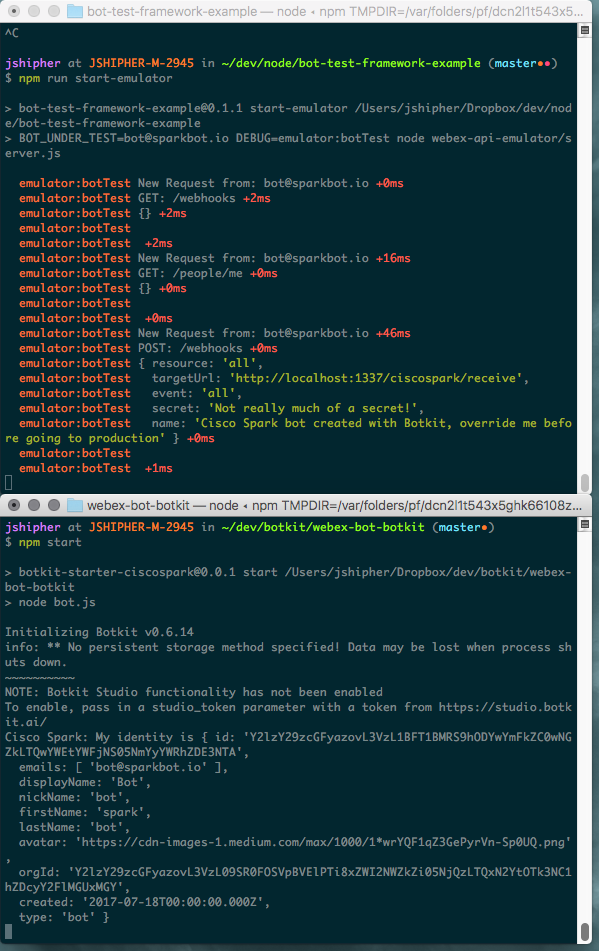

# webex-bot-botkit
This is a fork of the [Botkit Starting Point for Webex Teams](https://github.com/howdyai/botkit-starter-ciscospark), which provides an example of how to create a Webex Teams bot using botkit.   This fork is designed to provide  a companion botkit based bot that works with the [webex-api-emulator](https://github.com/webex/webex-api-emulator) which allows developers to run regression tests against their bots.

Developers who are working with the [bot-test-framework-example](https://github.com/jpjpjp/bot-test-framework-example) can use this project as a replacement for the node-flint based example included in that project.   As you work through the steps to run the tests as described in the [bot-test-framework-example README](https://github.com/jpjpjp/bot-test-framework-example/blob/master/README.md), replace the section titled "Running the bot in test mode" with the following instructions:

* clone this repository
* run `npm install` to download the dependencies
* run `npm start` to start the bot

If you've started the emulator, and then this bot properly you should see two terminal windows that look something like:



## Making your own bot testable
Once you get this bot running with the [bot-test-framework-example](https://github.com/jpjpjp/bot-test-framework-example), and understand how it works you may want to make your own bot testable with the [webex-api-emulator](https://github.com/webex/webex-api-emulator).    There are just a few steps necessary to do this, all demonstrated in this project.

1) Configure your environment so that the bot sends requests to the Webex API emulator.   The provided [.env](./.env) file demonstrates how to do this.   This file can be used as is with your bot if you are running the webex api emulator locally with the tokens.json file that comes with the base project.

2) Modify [components/subscribe_events.js](./components/subscribe_events.js) to allow for registering an http://localhost based URL for the webehooks.   Typically this involves replacing this line:
    ```
    var hook_url = 'https://' + controller.config.public_address + '/ciscospark/receive';
    ```
  
    with this:
    ```
    if (process.env.public_address.startsWith('http://')) {
        // If environment specifies non https don't force the webhook URL to be https
        // This generally only happens if we are using a local webex API emulator
        var hook_url = 'http://' + controller.config.public_address + '/ciscospark/receive';
    } else {
        var hook_url = 'https://' + controller.config.public_address + '/ciscospark/receive';
    }
    ```

  Note that this step is uncessary if you are able to register an https based address (perhaps by using a tool like ngrok).

After that start your bot as you would normally and it should talk to the webex api emulator.   Begin building test cases in postman as described in the [bot-test-framework-example README](https://github.com/jpjpjp/bot-test-framework-example/blob/master/README.md)

What follows is the original botkit starter project's readme:

# Botkit Starter Kit for Cisco Spark Bots

This repo contains everything you need to get started building a Cisco Spark bot with [Botkit](https://botkit.ai) and [Botkit Studio](https://botkit.ai).

Botkit is designed to ease the process of designing and running useful, creative bots that live inside messaging platforms. Bots are applications that can send and receive messages, and in many cases, appear alongside their human counterparts as users.

Some bots talk like people, others silently work in the background, while others present interfaces much like modern mobile applications. Botkit gives developers the necessary tools for building bots of any kind! It provides an easy-to-understand interface for sending and receiving messages so that developers can focus on creating novel applications and experiences instead of dealing with API endpoints.

Our goal with Botkit is to make bot building easy, fun, and accessible to anyone with the desire to create a future filled with talking machines!

If you are looking to create a bot on other platforms using Glitch, check out the [Botkit project page](https://glitch.com/botkit).

#### Use Botkit Studio
[Botkit Studio](https://studio.botkit.ai/signup?code=ciscoglitch) is a set of tools that adds capabilities to the open source Botkit library by offering hosted GUI interfaces for script management and action trigger definition. 

While Botkit Studio is *not required* to build a bot using Botkit, we highly recommend it as your bot will be easier to manage, customize and extend.

### What's Included
* [Botkit core](https://github.com/howdyai/botkit/blob/master/docs/readme.md#developing-with-botkit) - a complete programming system for building conversational software
* [Botkit Studio API](https://github.com/howdyai/botkit/blob/master/docs/readme-studio.md#function-index) - additional APIs that extend Botkit with powerful tools and APIs
* [Pre-configured Express.js webserver](https://expressjs.com/) including:
   * A customizable "Install my Bot" homepage
   * Webhook endpoints for communicating with platforms
* Sample skill modules that demonstrate various features of Botkit
* A component that manages your app's webhook subscriptions

### Getting Started

There are a few steps to get started on working on a Botkit bot:

#### Installing Botkit

[Remix this project on Glitch](https://glitch.com/~botkit-ciscospark)

[Deploy to Heroku](https://heroku.com/deploy?template=https://github.com/howdyai/botkit-starter-ciscospark/master)

Clone this repository:

`git clone https://github.com/howdyai/botkit-starter-ciscospark.git`

Install dependencies, including [Botkit](https://github.com/howdyai/botkit):

```
cd botkit-starter-ciscospark
npm install
```

#### Set up your Cisco Spark Application 
Once you have setup your Botkit developer enviroment, the next thing you will want to do is set up a new Cisco Spark application via the [Cisco Spark developer portal](https://developer.ciscospark.com/). This is a multi-step process, but only takes a few minutes. 

[Read this step-by-step guide](https://github.com/howdyai/botkit/blob/master/docs/provisioning/cisco-spark.md) to make sure everything is set up. 

Next, get a Botkit Studio token [from your Botkit developer account](https://studio.botkit.ai/) if you have decided to use Studio. 

Update the `.env` file with your newly acquired tokens.

Launch your bot application by typing:

`node .`

Cisco Spark requires your application be available at an internet-accessible endpoint. To expose an endpoint during development, we recommend using [localtunnel.me](http://localtunnel.me) or [ngrok](http://ngrok.io), either of which can be used to temporarily expose your bot to the internet. 

Now comes the fun part of [making your bot!](https://github.com/howdyai/botkit/blob/master/docs/readme.md#basic-usage)


### Extend This Starter Kit

This starter kit is designed to provide developers a robust starting point for building a custom bot. Included in the code are a set of sample bot "skills" that illustrate various aspects of the Botkit SDK features.  Once you are familiar with how Botkit works, you may safely delete all of the files in the `skills/` subfolder.

Developers will build custom features as modules that live in the `skills/` folder. The main bot application will automatically include any files placed there.

A skill module should be in the format:

```
module.exports = function(controller) {

    // add event handlers to controller
    // such as hears handlers that match triggers defined in code
    // or controller.studio.before, validate, and after which tie into triggers
    // defined in the Botkit Studio UI.

}
```

Continue your journey to becoming a champion botmaster by [reading the Botkit Studio SDK documentation here.](https://github.com/howdyai/botkit/blob/master/docs/readme-studio.md)


### Customize Storage

By default, the starter kit uses a simple file-system based storage mechanism to record information about the teams and users that interact with the bot. While this is fine for development, or use by a single team, most developers will want to customize the code to use a real database system.

There are [Botkit plugins for all the major database systems](https://github.com/howdyai/botkit/blob/master/docs/readme-middlewares.md#storage-modules) which can be enabled with just a few lines of code.

We have enabled our [Mongo middleware]() for starters in this project. To use your own Mongo database, just fill out `MONGO_URI` in your `.env` file with the appropriate information. For tips on reading and writing to storage, [check out these medium posts](https://botkit.groovehq.com/knowledge_base/categories/build-a-bot)

# Developer & Support Community

You can find full documentation for Botkit on our [GitHub page](https://github.com/howdyai/botkit/blob/master/readme.md). Botkit Studio users can access the [Botkit Studio Knowledge Base](https://botkit.groovehq.com/help_center) for help in managing their account.

###  Need more help?
* Glitch allows users to ask the community for help directly from the editor! For more information on raising your hand, [read this blog post.](https://medium.com/glitch/just-raise-your-hand-how-glitch-helps-aa6564cb1685)

* Join our thriving community of Botkit developers and bot enthusiasts at large. Over 4500 members strong, [our open Slack group](http://community.botkit.ai) is _the place_ for people interested in the art and science of making bots. 

You can also find help from members of the Botkit team [in our dedicated Cisco Spark room](https://eurl.io/#SyNZuomKx)!


 Come to ask questions, share your progress, and commune with your peers!

* We also host a [regular meetup and annual conference called TALKABOT.](http://talkabot.ai) Come meet and learn from other bot developers! 
 
 [Full video of our 2016 event is available on Youtube.](https://www.youtube.com/playlist?list=PLD3JNfKLDs7WsEHSal2cfwG0Fex7A6aok)


# About Botkit 

Botkit is a product of [Howdy](https://howdy.ai) and made in Austin, TX with the help of a worldwide community of botheads.
